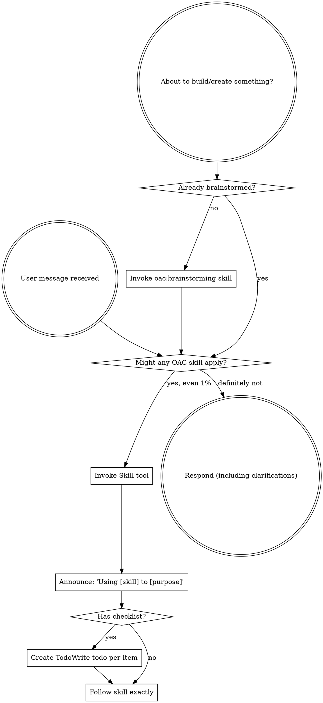

<EXTREMELY-IMPORTANT>
If you think there is even a 1% chance an OAC skill might apply to what you are doing, you ABSOLUTELY MUST invoke the skill.

IF A SKILL APPLIES TO YOUR TASK, YOU DO NOT HAVE A CHOICE. YOU MUST USE IT.

This is not negotiable. This is not optional. You cannot rationalize your way out of this.
</EXTREMELY-IMPORTANT>

## How to Access Skills

**In Claude Code:** Use the `Skill` tool. When you invoke a skill, its content is loaded and presented to you—follow it directly. Never use the Read tool on skill files.

# Using OAC Skills

## The Rule

**Invoke relevant or requested skills BEFORE any response or action.** Even a 1% chance a skill might apply means that you should invoke the skill to check. If an invoked skill turns out to be wrong for the situation, you don't need to use it.

## Available OAC Skills

| Skill | When to invoke |
|-------|---------------|
| `oac:using-oac` | This skill — loaded at session start |
| `oac:brainstorming` | BEFORE any creative work, building features, adding functionality |
| `oac:context-discovery` | BEFORE implementing anything — find standards and patterns |
| `oac:task-breakdown` | When breaking complex features into subtasks |
| `oac:code-execution` | When implementing code subtasks |
| `oac:test-generation` | When creating tests |
| `oac:code-review` | When reviewing code changes |
| `oac:external-scout` | When working with external libraries/packages |
| `oac:parallel-execution` | When running multiple agents in parallel |
| `oac:systematic-debugging` | BEFORE proposing any fix for a bug or test failure |
| `oac:verification-before-completion` | BEFORE claiming any work is complete or tests pass |

## Skill Priority

When multiple skills could apply, use this order:

1. **Process skills first** (brainstorming, debugging) — these determine HOW to approach the task
2. **Implementation skills second** (context-discovery, task-breakdown, code-execution) — these guide execution

"Let's build X" → brainstorming first, then context-discovery, then implementation skills.
"Fix this bug" → systematic-debugging first, then verification-before-completion.

## Red Flags

These thoughts mean STOP — you're rationalizing:

| Thought | Reality |
|---------|---------|
| "This is just a simple question" | Questions are tasks. Check for skills. |
| "I need more context first" | Skill check comes BEFORE clarifying questions. |
| "Let me explore the codebase first" | Skills tell you HOW to explore. Check first. |
| "I can check git/files quickly" | Files lack conversation context. Check for skills. |
| "Let me gather information first" | Skills tell you HOW to gather information. |
| "This doesn't need a formal skill" | If a skill exists, use it. |
| "I remember this skill" | Skills evolve. Read current version. |
| "This doesn't count as a task" | Action = task. Check for skills. |
| "The skill is overkill" | Simple things become complex. Use it. |
| "I'll just do this one thing first" | Check BEFORE doing anything. |
| "This feels productive" | Undisciplined action wastes time. Skills prevent this. |
| "I know what that means" | Knowing the concept ≠ using the skill. Invoke it. |

## Skill Types

**Rigid** (systematic-debugging, verification-before-completion): Follow exactly. Don't adapt away discipline.

**Flexible** (brainstorming, context-discovery): Adapt principles to context.

The skill itself tells you which.

## User Instructions

Instructions say WHAT, not HOW. "Add X" or "Fix Y" doesn't mean skip workflows.
